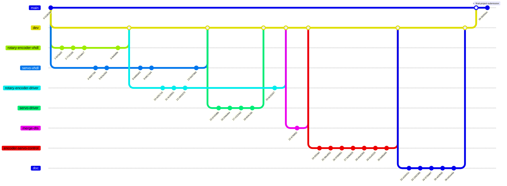

# Feature branch workflow for final project

The branching workflow we'll use is the [feature branch workflow](https://www.atlassian.com/git/tutorials/comparing-workflows/feature-branch-workflow) plus a `dev` branch; or, equivalently, the [gitflow workflow](https://www.atlassian.com/git/tutorials/comparing-workflows/gitflow-workflow) minus release/hotfix/support branches.

Essentially, you'll have a `dev` branch, from which you'll create and merge feature branches. Once all development is done and you're ready to "make a release" (i.e., submit your project), you'll merge `dev` into `main`. An example of this is shown in the git history graph below. Normally, a project will make multiple releases (i.e., merge `dev` into `main` multiple times throughout its life).

Every time you are done with a feature branch, you'll [create a pull request](https://docs.github.com/en/pull-requests/collaborating-with-pull-requests/proposing-changes-to-your-work-with-pull-requests/creating-a-pull-request). Your team member will review your pull request, suggesting changes or improvements. Once the pull request is approved, you will merge the feature branch into `dev`.

