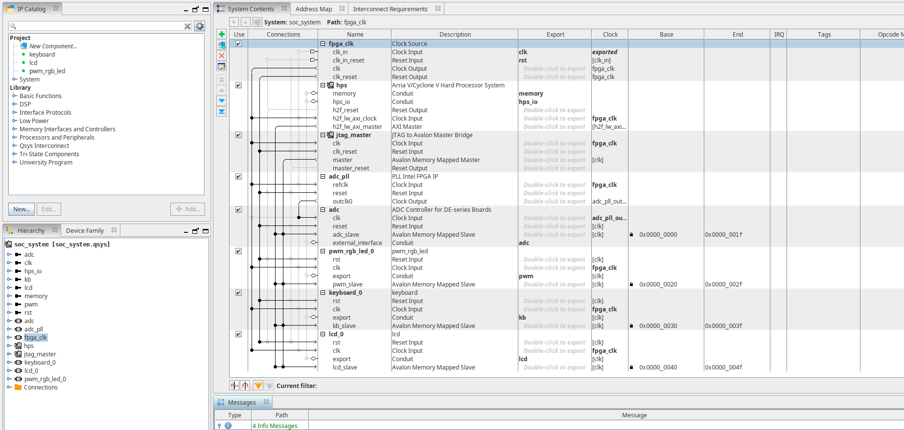
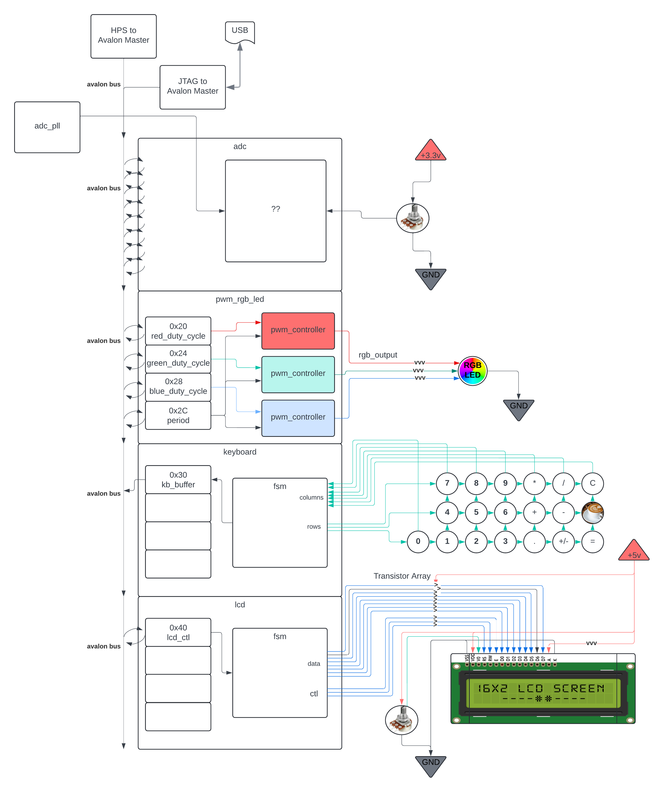

# Quartus Files

This directory is for quartus project files.The **final-project** folder contains a Quartus project with custom components that connect to the hard processor system (HPS). The **test** folder, on the other hand, is simply for testing
one's designs directly with the GPIO pins, LEDs, and switches. This removes the need to export connections and
reduces compile times significantly. Below is a brief overview of the most important files found in the
**final-project** folder. Most of the others are irrelevant and are just so Quartus can compile the design. 

#### final-project/final_project.qpf

The Quartus project file. Open this with quartus to inspect the project hardware.

#### final-project/de10nano_pin_assignments.qsf

This file must be imported under _Assignments -> Import Assignments..._ before anything is compiled. It contains the
pin assignments with the correct names for our specific board's pins (DE10-Nano) and top-level VHDL entity ports.

#### final-project/soc_system.qsys

The project's Platform Designer file. Open this with Platform Designer to be shown a screen like below. 

## Complete diagram of components

There are a lot of components!

